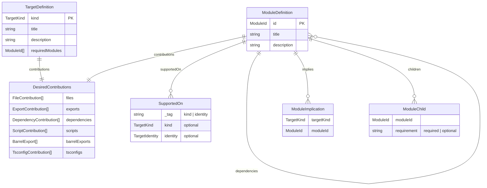
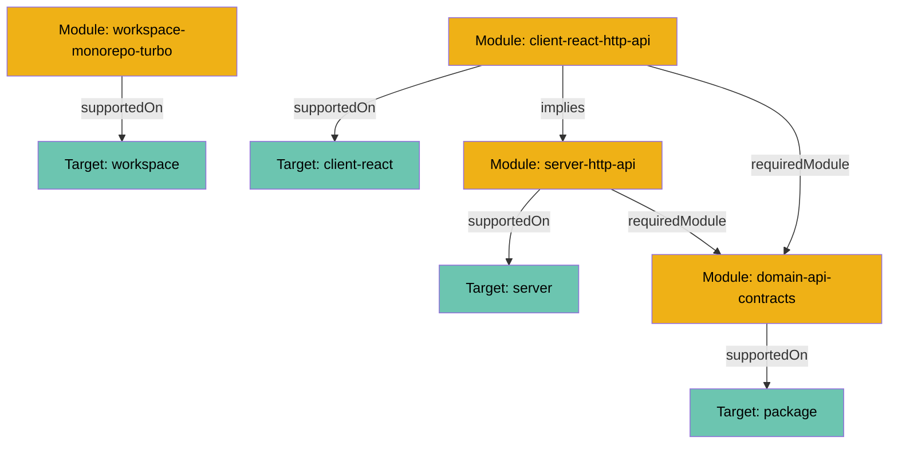
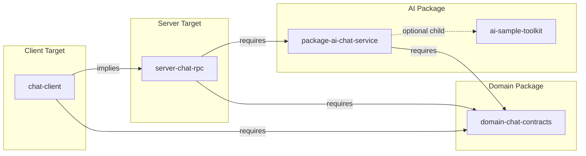

# Catalog Package Architecture

> Internal architecture documentation for `@repo/catalog`. For domain term
> definitions, see [DOMAIN_LEXICON.md](../DOMAIN_LEXICON.md).

## Overview

The catalog package is a **read-only registry** that defines what targets and
modules can exist, their compatibility, and dependency relationships. It
serves as the source of truth for the scaffold system's available capabilities.

**Package**: `@repo/catalog`  
**Single Export**: `CatalogService`  
**Role in Pipeline**: Provides lookup services consumed by BlueprintService and
PlanService

## Package Structure

```bash
packages/catalog/
╰── src/
    ├── index.ts              # Public export (CatalogService only)
    ├── CatalogService.ts     # Service layer with lookup methods
    ╰── registry/
        ├── targetRegistry.ts # Target definitions
        ├── moduleRegistry.ts # Module definitions
        ╰── content/          # Template files with token placeholders
```

## Internal Entities

### CatalogService

The single public boundary for all catalog operations. Provides:

| Method                | Purpose                                            |
| --------------------- | -------------------------------------------------- |
| `getTarget`           | Look up a target definition by kind                |
| `getModule`           | Look up a module definition by ID                  |
| `isSupportedOn`       | Check if module can attach to a target identity    |
| `isImpliedByAny`      | Check if module is implied by any implication rule |
| `getImplications`     | Get all implied modules for given module set       |
| `getSupportedModules` | Get all modules supported on a target kind         |

Properties:

| Property      | Purpose                                     |
| ------------- | ------------------------------------------- |
| `targetKinds` | All available target kinds (excluding workspace) |
| `toGraph`     | Full catalog as a directed graph            |

### Target Registry

Defines target kinds with their base contributions:

| Kind             | Purpose                | Key Contributions             |
| ---------------- | ---------------------- | ----------------------------- |
| `workspace`      | Workspace setup        | .gitignore, root package.json |
| `client-react`   | React client app       | React app, Vite config        |
| `client-foldkit` | Foldkit client app     | Foldkit app, Vite config      |
| `server`         | Server application     | Bun HTTP server               |
| `cli`            | CLI application        | Effect CLI entrypoint         |
| `package`        | Shared package         | tsconfig, scripts             |

### Module Registry

Defines modules organized by category:

- **Workspace modules**: workspace-monorepo-turbo, workspace-quality-biome, workspace-test-vitest
  (supported on `workspace` target)
- **Client modules**: client-react-http-api, client-react-http-rpc, client-react-chat,
  client-react-ws-presence (supported on `client-react` target, imply server counterparts)
- **Server modules**: server-http-api, server-http-rpc, server-chat-rpc,
  server-ws-presence (supported on `server` target)
- **Domain modules**: domain-api-contracts, domain-rpc-contracts, domain-chat-contracts, domain-ws-contracts
  (supported on `package/domain` identity)
- **Infrastructure modules**: package-ai-core, package AI toolkits, package-ai-chat-service, package-presence-service
  (supported on specific package identities)

Modules may declare `children` for same-target parent-child relationships used
in nested selection UI. Children are either `required` (auto-selected with
parent) or `optional` (user-toggleable). Modules listed as children are excluded
from top-level selection lists.

### Content Templates

Template files in `content/` use a token substitution system:

| Token                    | Resolves To                        |
| ------------------------ | ---------------------------------- |
| `{{targetPath}}`         | Target's filesystem path           |
| `{{targetDir}}`          | Alias for targetPath               |
| `{{targetKind}}`         | Target kind (client, server, etc.) |
| `{{targetName}}`         | Target name (or kind if empty)     |
| `{{runtime}}`            | "bun" or "node"                    |
| `{{packageManager}}`     | "bun", "npm", or "pnpm"            |
| `{{packageManagerSpec}}` | Full spec (e.g., "bun@1.2.21")     |
| `{{projectName}}`        | Project name from config           |

Templates are organized by target type (init.ts, client.ts, server.ts) and
feature (api.ts, rpc.ts, chat.ts, websocket.ts, ai.ts, presence.ts).

## Entity Relationships



## Catalog Graph Structure

The `CatalogService.toGraph` property exposes the full catalog as a directed
graph using Effect's Graph module:



**Node Types**:

- `{_tag: "target", definition: TargetDefinition}`
- `{_tag: "module", definition: ModuleDefinition}`

**Edge Types**:

- `supportedOn`: Module can attach to target
- `requiredModule`: Module depends on another module
- `implies`: Module implies another module on a different target
- `childOf`: Module is a child of another module (same-target parent-child)

## Dependency Chains

Client modules that imply server counterparts create cross-target dependency
chains:



Note: `ai-sample-toolkit` is an **optional child** of `package-ai-chat-service`, shown
in nested selection UI when the parent is selected. This differs from
dependencies which are always resolved by BlueprintService.

## Integration Points

The catalog is consumed by:

1. **BlueprintService** (scaffold): Validates selections and resolves
   dependencies using `getModule`, `isSupportedOn`, `getImplications`
2. **ContributionResolver** (scaffold): Looks up contributions and resolves
   tokens using `getTarget`, `getModule`
3. **CLI graph command**: Visualizes the catalog using `toGraph`

## Invariants

- Catalog data is immutable at runtime
- A module can only attach to targets matching its `supportedOn` rules
- Module dependencies reference existing modules (validated by tests)
- Module implications reference existing modules (validated by tests)
- All module IDs are unique across the registry
