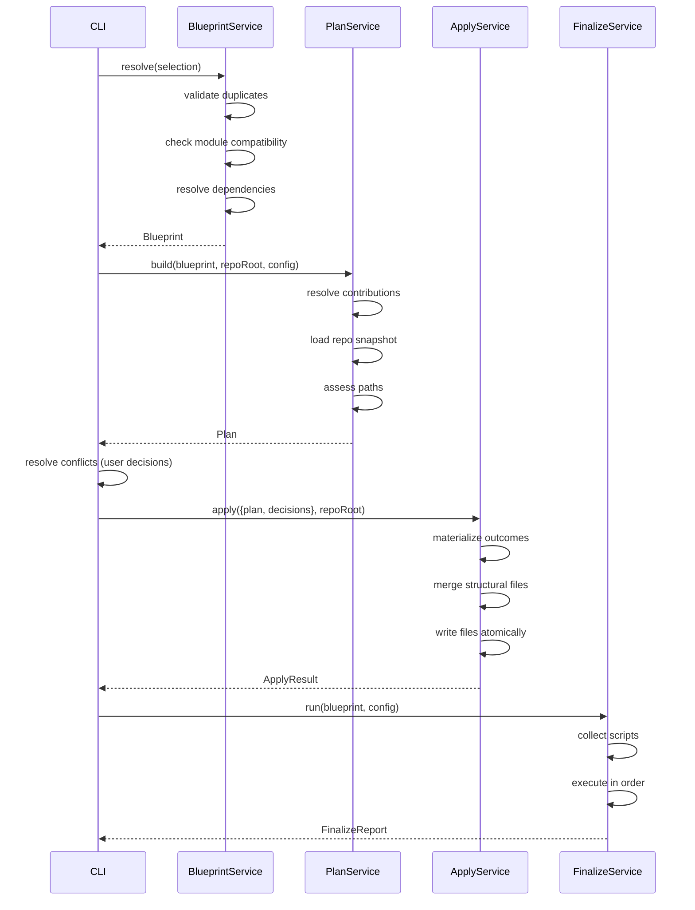
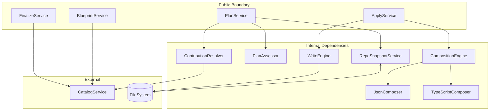
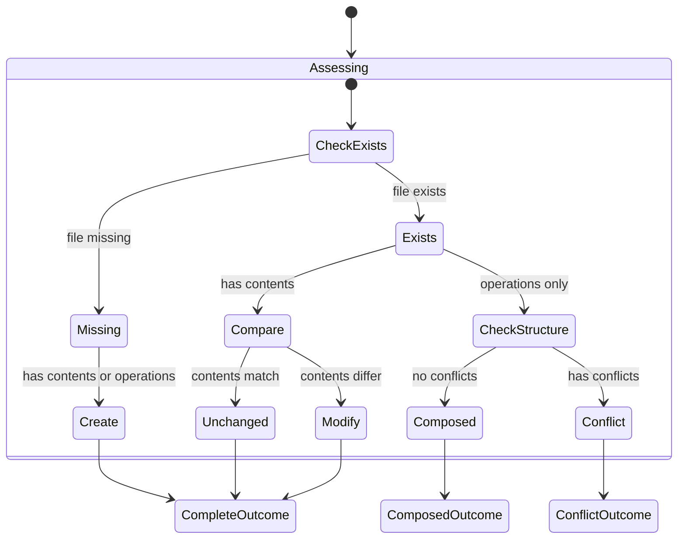

# Scaffold Package Architecture

> Internal architecture documentation for `@repo/scaffold`. For domain term
> definitions, see [DOMAIN_LEXICON.md](../DOMAIN_LEXICON.md).

## Overview

The scaffold package provides **runtime orchestration services** that transform
user selections into repository changes. It implements the core pipeline:

```txt
Selection ──> Blueprint ┬─> Plan ──> Apply ──> ApplyResult
                        ╰───────────────────────────────────> FinalizeReport
```

**Package**: `@repo/scaffold`  
**Role**: Executes the scaffold pipeline from resolved intent to filesystem
changes

## Package Structure

```txt
packages/scaffold/
╰── src/
    ├── index.ts                    # Public exports
    ╰── service/
        ├── ScaffolFormatter.ts     # Display formatting
        ├── blueprint/
        │   ╰── BlueprintService.ts # Selection -> Blueprint
        ├── plan/
        │   ├── PlanService.ts      # Blueprint -> Plan
        │   ├── ContributionResolver.ts
        │   ├── PlanAssessor.ts
        │   ╰── RepoSnapshotService.ts
        ├── apply/
        │   ├── ApplyService.ts     # Plan -> ApplyResult
        │   ├── CompositionEngine.ts
        │   ├── JsonComposer.ts
        │   ├── TypeScriptComposer.ts
        │   ╰── WriteEngine.ts
        ╰── finalize/
            ╰── FinalizeService.ts  # Script execution
```

## Services Overview

| Service              | Boundary | Purpose                                   |
| -------------------- | -------- | ----------------------------------------- |
| BlueprintService     | Public   | Selection validation + dependency closure |
| PlanService          | Public   | Blueprint to repo-aware plan              |
| ContributionResolver | Public   | Token substitution for contributions      |
| PlanAssessor         | Public   | Path classification and conflicts         |
| ApplyService         | Public   | Plan execution with decisions             |
| FinalizeService      | Public   | Post-apply script execution               |
| ScaffoldFormatter    | Public   | Blueprint/Plan display formatting         |
| RepoSnapshotService  | Internal | Filesystem state loading                  |
| CompositionEngine    | Internal | Dispatches JSON/TypeScript composition    |
| JsonComposer         | Internal | package.json field merging                |
| TypeScriptComposer   | Internal | AST-based TypeScript manipulation         |
| WriteEngine          | Internal | Atomic file writes                        |

## Pipeline Sequence



## Service Composition



## BlueprintService

**Input**: `Selection` (user intent)  
**Output**: `Blueprint` (dependency closure graph)

### Internal Process

1. **Validation Phase**
   - Check for duplicate target selections
   - Check for duplicate module selections per target
   - Validate module-target compatibility via CatalogService

2. **Resolution Phase**
   - Uses `ResolutionState` (mutable Ref with HashMaps)
   - `ensureTarget`: Lazily creates target nodes
   - `ensureAttachedModule`: Creates module nodes, resolves dependencies
   - Creates edges: `owns-module`, `required-target`, `required-module`

### Blueprint Structure

Nodes:

- `BlueprintTargetNode`: `{_tag: "target", id: TargetKey, identity}`
- `BlueprintAttachedModuleNode`: `{_tag: "attached-module", id, targetId, moduleId}`

Edges:

- `owns-module`: Target owns an attached module
- `required-target`: Module requires a target to exist
- `required-module`: Module requires another module

## PlanService

**Input**: `Blueprint`, `repoRoot`, `StackConfig`  
**Output**: `Plan` (repo-aware outcomes + conflicts)

### Internal Process


1. **Contribution Resolution** (ContributionResolver)
   - Look up target/module contributions from catalog
   - Resolve tokens ({{targetPath}}, {{projectName}}, etc.)
   - Return `NormalizedContributions`

2. **Intent Compilation**
   - Convert contributions to `PlanningIntentPath` entries
   - Group by file path with all contribution data

3. **Snapshot Loading** (RepoSnapshotService)
   - Load current filesystem state for relevant paths
   - Return `RepoSnapshot` with missing/directory/file entries

4. **Plan Projection** (PlanAssessor)
   - Validate ancestor directories
   - Classify each path: create/modify/unchanged/conflict
   - Detect conflicts in structural files

### PlanningIntentPath

Internal representation of a planned file:

| Field           | Purpose                               |
| --------------- | ------------------------------------- |
| `path`          | Absolute file path                    |
| `contents`      | Full file contents (if authoritative) |
| `exports`       | package.json exports to add           |
| `dependencies`  | package.json dependencies to add      |
| `scripts`       | package.json scripts to add           |
| `barrelExports` | Re-export statements to add           |
| `tsconfig`      | tsconfig.json contents                |

### Plan Outcome Types



**Outcome Types**:

- `complete`: Full file contents known (create/modify/unchanged)
- `composed`: Base content + composition operations (JSON or TypeScript)

**Classifications**:

- `create`: File does not exist, will be created
- `modify`: File exists, contents differ
- `unchanged`: File exists, contents match
- `conflict`: Structural conflict detected

## ApplyService

**Input**: `Apply` (plan + decisions), `repoRoot`  
**Output**: `ApplyResult` (created/modified/skipped/failed)

### Internal Process

1. **Materialize Actions**
   - Convert Plan outcomes + decisions to actions
   - Skip unchanged files
   - Apply conflict decisions (override/skip)

2. **Composition** (CompositionEngine)
   - Filters operations by `fileType` discriminator (`"json"` or `"typescript"`)
   - Dispatches to JsonComposer for package.json files
   - Dispatches to TypeScriptComposer for .ts/.tsx files
   - Returns typed errors in Effect error channel

3. **File Writing** (WriteEngine)
   - Atomic writes (temp file + rename)
   - Validate writeMode vs file existence
   - Create parent directories as needed

### Composition Operations

Operations are tagged unions with a `fileType` discriminator for type-safe filtering:

**JSON Operations** (`fileType: "json"`):

- `json-pkg-exports`: Merge entries into package.json exports field
- `json-pkg-deps`: Merge entries into dependencies/devDependencies
- `json-pkg-scripts`: Merge entries into scripts field

**TypeScript Operations** (`fileType: "typescript"`):

- `ts-add-import`: Add import statement (named, default, or type-only)
- `ts-add-reexport`: Add re-export statement (star or named)
- `ts-append-call-arg`: Append argument to function call by variable/function name

### Materialized Actions

| Action                | When Applied                         |
| --------------------- | ------------------------------------ |
| `skip`                | unchanged or decision=skip           |
| `write-authoritative` | complete outcome, create/modify      |
| `write-composed`      | composed outcome (base + operations) |

### WriteMode

| Mode       | Expects      | Behavior        |
| ---------- | ------------ | --------------- |
| `create`   | File missing | Fail if exists  |
| `modify`   | File exists  | Fail if missing |
| `override` | Either       | Always write    |

## FinalizeService

**Input**: `Blueprint`, `FinalizeConfig`  
**Output**: `FinalizeReport`

### Script Collection Order

1. Target finalize scripts (from catalog)
2. Module finalize scripts (topological order by dependencies)
3. Config-derived scripts:
   - `{pm} install` (always)
   - `{pm} run lint` (if lint: "biome")
   - `{pm} run format` (if format: "biome")

### Domain Types

**FinalizeScript** (input — resolved, ready-to-run):

| Field     | Type   |
| --------- | ------ |
| `label`   | String |
| `command` | String |
| `workdir` | String |

**ScriptResult** (output — tagged union):

| Variant   | Fields                        |
| --------- | ----------------------------- |
| `Success` | label, command, output        |
| `Failure` | label, command, output, error |

**FinalizeReport** (aggregate):

| Field     | Type           |
| --------- | -------------- |
| `results` | ScriptResult[] |

## ScaffoldFormatter

Formats Blueprint and Plan for CLI display.

**Blueprint Output**:

```bash
Blueprint:
- apps/server-api (server)
  ╰╌> apps/server-api#server-http-api
       ├─> packages/domain [required-target]
       ╰─> packages/domain#domain-api-contracts [required-module]
```

**Plan Output**:

```bash
Plan:
[+] create  [~] modify  [=] unchanged  [!] conflict
1 create  1 modify  1 unchanged  2 conflict
.
├── packages/domain/
│   ╰── src/
│       ╰── [+] Api.ts
╰── [~] README.md
```

## Error Types

| Error                   | Service            | Causes                                                |
| ----------------------- | ------------------ | ----------------------------------------------------- |
| `BlueprintFailure`      | Blueprint          | Duplicate selections, unsupported modules             |
| `CatalogNotFound`       | Blueprint/Plan     | Missing target/module definitions                     |
| `PlanFailure`           | Plan               | File blocking directory, invalid intent               |
| `ApplyFailure`          | Apply              | Invalid decisions, write failures, composition errors |
| `JsonCompositionError`  | JsonComposer       | JSON parse/stringify failure                          |
| `TsTargetNotFoundError` | TypeScriptComposer | AST target variable or function not found             |

## Layer Composition

Services declare dependencies via Effect Layers:

```bash
BlueprintService.layer
  ╰── CatalogService.layer

PlanService.layer
  ├── ContributionResolver.layer
  ├── RepoSnapshotService.layer
  ├── PlanAssessor.layer
  ╰── CatalogService.layer

ApplyService.layer
  ├── WriteEngine.layer
  ╰── CompositionEngine.layer
        ├── JsonComposer.layer
        ╰── TypeScriptComposer.layer

FinalizeService.layer
  ╰── CatalogService.layer
```

## Invariants

- Blueprint is dependency closure only, no file contributions
- Plan is policy-free, no apply decisions
- Apply decisions required only for conflict classifications
- Missing or extra decisions make Apply invalid
- A module contributes only to its owning target
- Cross-target effects modeled via dependencies, not direct writes
- File writes are atomic (temp + rename pattern)
- Finalize scripts run in topological dependency order
