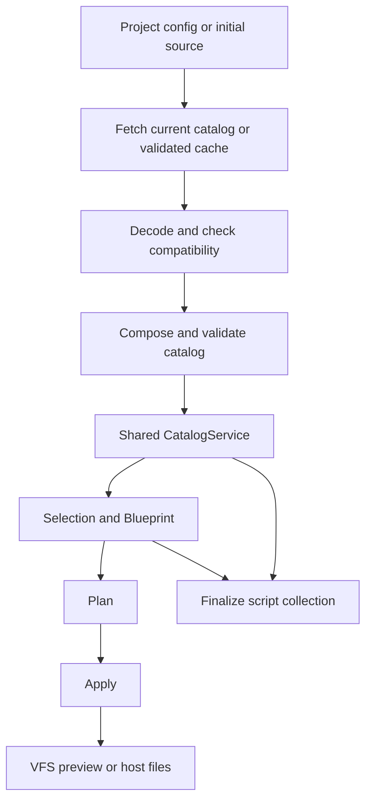

# Release the catalog independently

Use a Stack Effect-owned JSON format at a mutable `/registry/v1/catalog.json` endpoint on the docs site. Load and validate one catalog for each CLI command or Recipe Builder session. Keep payloads and version pins out of project configuration. Reuse a validated local cache with a visible warning during outages; otherwise fail clearly. Keep declarative contributions authoritative and use VFS for generated workspaces.

The accepted [catalog distribution decision](../architecture/catalog-distribution.md "records the selected tradeoffs") chooses a mutable channel over the initial immutable-release proposal. GitHub issues own implementation scope and acceptance evidence. This report retains the research findings and alternatives; no deployed registry is claimed. “CDN registry” is interpreted here as the shadcn-style JSON registry pattern. The comparison covers static HTTP, split assets, npm/CDN, OCI artifacts, and VFS snapshots.

## The current model already fits JSON

The catalog holds target and module definitions, dependencies, compatibility rules, template strings, and six tagged contribution types. These include full files, package entries, barrel exports, TypeScript edits, and JSX slots. Loading the full definitions preserves composition and unresolved configuration tokens. The smaller `CatalogTree` and `BuilderCatalog` projections omit generation data and cannot serve as the downloadable catalog. [Definition contracts](https://github.com/lloydrichards/stack-effect/blob/375c27c8568f07d44c5ba4c095e31dc60ff9bc38/packages/domain/src/Catalog.ts), [catalog projections](https://github.com/lloydrichards/stack-effect/blob/375c27c8568f07d44c5ba4c095e31dc60ff9bc38/packages/catalog/src/CatalogService.ts).

A local probe encoded `{ targets: targetRegistry, modules: moduleRegistry }` through `Schema.fromJsonString(Schema.Struct(...))`, using arrays of `TargetDefinition` and `ModuleDefinition`. Decoding and encoding again produced identical bytes. All 62 dependency target identities regained callable `toKey()` methods. This matters because plain `JSON.parse` alone would lose schema-class behavior.

| Local measurement | Result |
| --- | ---: |
| Targets / modules | 7 / 71 |
| JSON, UTF-8 bytes | 352,696 |
| gzip, Node zlib defaults | 63,814 |
| Brotli, Node zlib defaults | 51,319 |
| Definition-level Finalize scripts | 4 |
| Contribution kinds represented | 6 |

Measured on 2026-09-27 at Stack Effect commit `375c27c8568f07d44c5ba4c095e31dc60ff9bc38`. The probe used `Schema.encodeSync`, `Schema.decodeUnknownSync`, `gzipSync`, and `brotliCompressSync`. Sizes exclude a future document envelope and HTTP headers. This proves serialization feasibility, not HTTP latency, browser memory, or CLI/browser generation parity. About 64 KB compressed is a strong reason to try one download before adding per-module fetching.

## Distribution choices and their costs

These are engineering judgments informed by the cited formats. No transport performance comparison was run.

| Direction | Benefit | Main cost | Suggested role |
| --- | --- | --- | --- |
| One JSON document with inline text | One consistent download; easy inspection and static hosting | Fetches the entire catalog; mutable content can change output over time | Selected as a mutable v1 channel |
| JSON index plus module or file assets | Fetch selected payloads; cache shared files | Dependency hydration, more requests, partial failures | Add if measured growth warrants it |
| JSON plus a VFS snapshot | Filesystem metadata and binary payload support | Codec coupling; still needs semantic definitions | Optional artifact or cache experiment |
| Data package on npm through a CDN | Existing release tooling and HTTP file access | Additional publication dependency | Alternative host for the same JSON |
| OCI artifact | Digest-addressed manifests and blobs | More registry and authentication machinery | Revisit for private artifact infrastructure |

[UNPKG](https://unpkg.com/) supports exact-version package file URLs. Use those to fetch a data file, not import remote JavaScript. [OCI artifact concepts](https://oras.land/docs/concepts/artifact/) provide content-addressed distribution, but that machinery is unnecessary for the initial static docs host.

shadcn is the closest precedent. Its build command emits registry item JSON under `public/r`, and its project configuration maps namespace aliases to registry URLs. Registry items distinguish package dependencies from registry dependencies. Borrow that publishing and lookup pattern while preserving Stack Effect's contribution and dependency model. Adapting shadcn items into Stack Effect modules would be a separate feature. [Registry publishing](https://ui.shadcn.com/docs/registry/getting-started), [namespaces](https://ui.shadcn.com/docs/registry/namespace), [item schema](https://ui.shadcn.com/docs/registry/registry-item-json).

JSON is the document format. A browser `Blob` is a byte container, and base64 is an encoding; neither supplies catalog identity, compatibility, or composition rules. Keep text as text and use HTTP compression. A future binary-asset requirement can add digest-addressed files without redesigning module semantics.

## Load once, then preserve the existing pipeline

The proposed flow is:



The loader resolves catalog data before dependency closure. Selection still expresses intent, Blueprint resolves dependencies, Plan describes repo-aware outcomes, and Apply executes approved intent. Finalize uses the same loaded catalog. Network loading should not occur inside these operations.

Today `CatalogService.make` directly indexes imported registries. `BlueprintService`, `ContributionResolver`, `PlanService`, `RecipePreviewService`, and `FinalizeService` provide the built-in layer internally. Supplying a remote catalog only to the CLI entrypoint would leave these paths coupled to the bundled definitions. [Catalog construction](https://github.com/lloydrichards/stack-effect/blob/375c27c8568f07d44c5ba4c095e31dc60ff9bc38/packages/catalog/src/CatalogService.ts), [Plan wiring](https://github.com/lloydrichards/stack-effect/blob/375c27c8568f07d44c5ba4c095e31dc60ff9bc38/packages/scaffold/src/service/plan/PlanService.ts), [preview wiring](https://github.com/lloydrichards/stack-effect/blob/375c27c8568f07d44c5ba4c095e31dc60ff9bc38/packages/scaffold/src/service/recipe/RecipePreviewService.ts).

Proposed ownership:

- `@repo/domain` defines the versioned catalog document, source reference, compatibility fields, and typed loading/validation failures.
- `@repo/catalog` provides pure composition, validation, lookup, and the authoring/export path. Split its bundled definitions into a separate entrypoint so runtime consumers cannot accidentally pull them into their bundles.
- A shared loader outside domain supplies decoding, compatibility checks, and verified cache handling. HTTP and storage implementations differ between CLI and browser; catalog semantics do not.
- Application composition selects and provides the catalog. Scaffold services require that service instead of quietly providing their own built-in catalog.

Keep a deliberate bundled adapter for local authoring and tests during migration. To finish decoupling, inspect both CLI and worker build outputs and prove they no longer contain the catalog templates.

## Use a mutable v1 channel without project pins

The chosen endpoint is `https://stack-effect.lloydrichards.dev/registry/v1/catalog.json`. The path versions the protocol, not individual content releases. Additions and template fixes may update the document while preserving existing IDs and supported operations. Projects can generate different output across dates. No semver history, immutable release archive, catalog lockfile, or project-local payload is required.

Freeze the v1 interpreter capability baseline at publication. Adding a module that requires a new engine operation cannot silently expand that baseline and reject older clients. Incompatible engine semantics require a separate protocol decision. Use a digest for diagnostics and for detecting cache corruption; it is not a content pin or publisher signature.

Older projects use the official URL internally without adopting a new configuration field. Newly generated configuration gets optional editor schema metadata:

```json
{
  "$schema": "https://stack-effect.lloydrichards.dev/schemas/v1/stack.effect.schema.json",
  "name": "my-app",
  "runtime": { "_tag": "bun" }
}
```

Generate the hosted JSON Schema from `StackConfig`. Editors can load it; the CLI still validates with its installed domain schema. Preserve `$schema` through configuration round trips without treating a user-supplied schema URL as executable behavior or a required runtime fetch. Public community-source configuration is a follow-up design task. [Current config schema](https://github.com/lloydrichards/stack-effect/blob/375c27c8568f07d44c5ba4c095e31dc60ff9bc38/packages/domain/src/Scaffold.ts), [existing JSON Schema export pattern](https://github.com/lloydrichards/stack-effect/blob/375c27c8568f07d44c5ba4c095e31dc60ff9bc38/apps/cli/src/commands/schema.ts).

Attempt a current fetch or HTTP revalidation on each CLI command and builder session. Keep the last fully validated document in a user cache for the CLI and browser storage for Recipe Builder. On transport/server outages, use a compatible cached document and report its age and source. If no usable cache exists, fail clearly. Do not conceal invalid documents or incompatible protocol updates behind a cached result. Keep an in-flight operation on one document throughout.

This replaces the earlier exact-pin recommendation. Immutable releases would offer stronger fresh-clone reproduction, but they add archive and update management that the owner does not want for this milestone.

## Community composition needs explicit rules

Issue [#249](https://github.com/lloydrichards/stack-effect/issues/249) proposes additive fragments, duplicate rejection, complete-catalog validation, and no contributed Finalize scripts initially. It deliberately excludes remote discovery. Its composition boundary is the best first dependency for this proposal.

Use named sources as provenance, not an implicit override order. Reject duplicate module IDs and target kinds. Validate all dependency, implication, child, capability, runtime, and conflict references after composition. Current `Map` construction can overwrite duplicate keys, while built-in integrity checks largely live in tests; downloaded data needs runtime validation. [Registry integrity tests](https://github.com/lloydrichards/stack-effect/blob/375c27c8568f07d44c5ba4c095e31dc60ff9bc38/packages/catalog/src/registry/moduleRegistry.test.ts).

For the first community slice, authors can use globally distinctive IDs such as `acme-client-analytics`, contributing to existing target kinds. Do not automatically prepend `@acme/` to target kinds: target kinds influence output paths, and CLI recipe syntax uses separators. A later qualified-reference design must separate source identity, logical ID, and filesystem naming. [Target identity and path rules](https://github.com/lloydrichards/stack-effect/blob/375c27c8568f07d44c5ba4c095e31dc60ff9bc38/packages/domain/src/Catalog.ts).

Choose dependencies explicitly at the source level. Community catalogs will need an explicit compatibility contract against the current official catalog; settle its syntax and source-selection UX in the follow-up milestone rather than introducing pins into official delivery. Avoid fetching additional registries merely because a document mentions a URL. Fail on incompatible source requirements rather than attempting a package-manager-style solver in v1.

New modules and target definitions can use the existing contribution vocabulary. Arbitrary configuration properties, custom target layouts, or new contribution kinds require engine changes. Existing tool configuration already maps values to module IDs, but runtime and TypeScript choices remain engine-defined. A community catalog does not automatically extend every form control or token. [Workspace tool mapping](https://github.com/lloydrichards/stack-effect/blob/375c27c8568f07d44c5ba4c095e31dc60ff9bc38/packages/scaffold/src/service/recipe/WorkspaceModules.ts).

JSON loading avoids evaluating remote catalog code, but definitions can contain shell commands, package scripts, and generated executable code. Keep contributed Finalize scripts disabled initially; show provenance and generated changes before Apply. Official scripts require an explicit publisher trust policy, not trust inferred from the alias `official`. Bound downloads and decoded content, reject unsupported protocol fields/capabilities, and validate rendered paths against the permitted workspace and ownership rules. [Script execution](https://github.com/lloydrichards/stack-effect/blob/375c27c8568f07d44c5ba4c095e31dc60ff9bc38/packages/scaffold/src/service/finalize/FinalizeService.ts).

## The docs site can host the registry

Generate `apps/docs/public/registry/v1/catalog.json` and `apps/docs/public/schemas/v1/stack.effect.schema.json` from the TypeScript authoring catalog and canonical config schema before building the docs site. Vite copies public assets unchanged and serves them from the root. Reference `/registry/...`, not `/public/registry/...`. A build plugin can emit the same files if generated public files are undesirable. The docs app already uses Vite and client rendering. [Vite public directory](https://vite.dev/guide/assets#the-public-directory), [docs build config](https://github.com/lloydrichards/stack-effect/blob/375c27c8568f07d44c5ba4c095e31dc60ff9bc38/apps/docs/vite.config.ts).

Use revalidation caching for the mutable documents. Publish the catalog and schema in one docs deployment, and verify the endpoints before releasing clients that depend on them. No historical-release retention service is planned. An ordinary site rollback is operational recovery, not a user-facing version API. [HTTP cache directives](https://developer.mozilla.org/en-US/docs/Web/HTTP/Reference/Headers/Cache-Control).

Same-origin official assets are simple for Recipe Builder. Community HTTP registries must permit cross-origin browser requests through CORS. Use correct JSON content types, support HTTPS, and return real 404 responses instead of the SPA fallback page. Hosting-provider header configuration and retained-release behavior remain unverified; no specific provider is assumed. [Browser CORS behavior](https://developer.mozilla.org/en-US/docs/Web/HTTP/Guides/CORS).

The worker currently loads `CatalogService.layer` and `RecipePreviewService.layer`. Add explicit loading, failure, retry, and ready states around catalog initialization. Use the same loaded document for choice lists and generated previews. Shared recipe URLs carry choices, not frozen catalog revisions. Reopening uses current data or disclosed cache fallback and reports choices that cannot be resolved. Resolve URLs against an explicit origin/base path, not the worker bundle's hashed location. [Worker](https://github.com/lloydrichards/stack-effect/blob/375c27c8568f07d44c5ba4c095e31dc60ff9bc38/apps/docs/app/workers/recipe-builder/recipe-builder.worker.ts), [recipe URL handling](https://github.com/lloydrichards/stack-effect/blob/375c27c8568f07d44c5ba4c095e31dc60ff9bc38/apps/docs/app/components/recipe-builder/recipe-builder-url.ts).

## VFS fits the output side

Stack Effect already uses `@effect-vfs/memory` in `ApplyWorkspaceService`. Keep it for isolated Plan/Apply previews. A registry can later carry literal file assets as a snapshot, but must still carry declarative operations. Two modules contributing cards to the same JSX slot cannot be replaced by two independently rendered whole-file snapshots without defining a separate merge policy. [Current workspace service](https://github.com/lloydrichards/stack-effect/blob/375c27c8568f07d44c5ba4c095e31dc60ff9bc38/packages/scaffold/src/service/apply/ApplyWorkspaceService.ts), [compiled profile research](compiled-catalog-profiles.md "separates declarations from compiled output").

Current VFS snapshots use newline-delimited JSON with base64 names and payloads. They support bounded streaming decode, including byte, record, entry, and line limits. A file occupies one line. This is useful filesystem transport, but it is not automatically a smaller catalog representation. [Snapshot codec](https://github.com/lloydrichards/effect-virtual-fs/blob/bef367506417d0c024ac490d3b4735da4ac93ccf/packages/core/src/VirtualFileSystem.ts#L1651-L1668), [decode limits](https://github.com/lloydrichards/effect-virtual-fs/blob/bef367506417d0c024ac490d3b4735da4ac93ccf/packages/core/src/Snapshot.ts#L83-L106).

There is also a concrete compatibility concern. The persistence changelog records an incompatible byte-format change while the header remained `version: 1`. A public registry should own its protocol version; if it later wraps VFS payloads, specify the precise codec compatibility and keep fixtures from earlier releases. [Recorded format break](https://github.com/lloydrichards/effect-virtual-fs/blob/bef367506417d0c024ac490d3b4735da4ac93ccf/packages/persistence/CHANGELOG.md#L41-L55).

Issue [#252](https://github.com/lloydrichards/stack-effect/issues/252) owns portable generated-workspace artifacts, and [#254](https://github.com/lloydrichards/stack-effect/issues/254) explores compiled profiles and cache identity. Both complement registry distribution, but neither must block an initial HTTP catalog.

## What the evidence does and does not establish

The local serialization round trip establishes that the current definitions fit JSON and that decoding restores required schema-class behavior. The catalog is small enough that a single compressed document is a reasonable initial transport. It does not establish production fetch time, browser memory cost, hosted headers, or equal generation results across the CLI and browser.

The source review identifies catalog injection as the main integration boundary. VFS evidence supports keeping generated-workspace storage separate from declarative module composition. Further measurements could justify split or binary assets as the catalog grows; they would not remove the need for schema validation, provenance, and one consistent catalog per operation.

Implementation work and its acceptance criteria live in GitHub issues, beginning with [catalog composition](https://github.com/lloydrichards/stack-effect/issues/249) and ending with [official registry qualification](https://github.com/lloydrichards/stack-effect/issues/275). The [accepted decision](../architecture/catalog-distribution.md "separates policy from execution") records freshness and compatibility choices without an implementation checklist.

## Evidence boundaries

The research inspected current source, repository issue bodies, official registry and hosting documentation, and the adjacent VFS checkout. The serialization experiment passed; no HTTP registry was implemented or deployed. Network performance, actual hosting-provider headers, and complete CLI/browser parity still need implementation evidence. The owner selected cache fallback and chose not to maintain an old-release archive; signatures are outside this milestone. The report proposes behavior rather than claiming it exists. The HTML companion uses the shared report scaffold; Mermaid and Highlight.js load from external CDNs, while prose and code remain readable without them.
