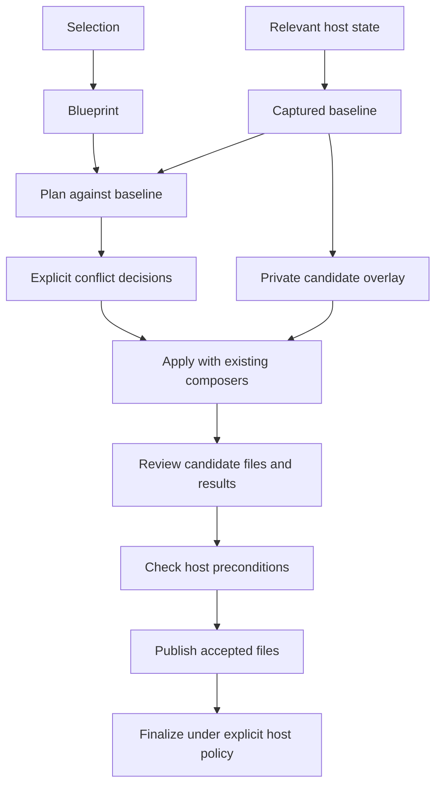

# Effect VFS in Stack Effect: design directions

Research review · 22 September 2026 · Discussion input, not an accepted design

## Start with a shared workspace, keep catalog intent explicit

Effect VFS fits Stack Effect best as a shared place to prepare, inspect, and repeat filesystem changes. Stack Effect already uses it for previews. The next useful step is to make the captured repository state and candidate result consistent across planning, decisions, and preview.

For the catalog, prefer immutable snapshots of selected generated recipes, with declarative modules remaining authoritative. An overlay is a private branch of one filesystem snapshot. It does not merge independently generated modules or resolve JSON and TypeScript conflicts. [preview: ApplyPreviewService.ts L31–175](https://github.com/lloydrichards/stack-effect/blob/b72a69a6deb0b5ad85c68b86ae75a6b7ef7379a3/packages/scaffold/src/service/apply/ApplyPreviewService.ts#L31-L175) [overlay: VirtualFileSystem.ts L1973–2035](https://github.com/lloydrichards/effect-virtual-fs/blob/e9df27fcb565d189bbc501500cc3267561b23533/packages/core/src/VirtualFileSystem.ts#L1973-L2035) [domain: Catalog.ts L126–223](https://github.com/lloydrichards/stack-effect/blob/b72a69a6deb0b5ad85c68b86ae75a6b7ef7379a3/packages/domain/src/Catalog.ts#L126-L223)

This report recommends exploring these directions, not replacing Selection, Blueprint, Plan, or Apply. The report records the initial review. Follow the [staged workspace research](staged-workspace.md "tracks the next design") for the concepts and issue links created afterward.

## What exists today

Selection expresses user intent. Blueprint resolves dependencies. Plan assesses proposed changes against repository contents. Apply combines those outcomes with explicit conflict decisions and executes them. Finalize runs commands derived from the Blueprint and configuration. These boundaries remain useful with a virtual filesystem. [plan: PlanService.ts L44–164](https://github.com/lloydrichards/stack-effect/blob/b72a69a6deb0b5ad85c68b86ae75a6b7ef7379a3/packages/scaffold/src/service/plan/PlanService.ts#L44-L164) [apply: ApplyService.ts L268–400](https://github.com/lloydrichards/stack-effect/blob/b72a69a6deb0b5ad85c68b86ae75a6b7ef7379a3/packages/scaffold/src/service/apply/ApplyService.ts#L268-L400) [finalize: FinalizeService.ts L107–212](https://github.com/lloydrichards/stack-effect/blob/b72a69a6deb0b5ad85c68b86ae75a6b7ef7379a3/packages/scaffold/src/service/finalize/FinalizeService.ts#L107-L212)

The current filesystem integration has two layers:

- `RecipePreviewService` resolves a recipe and builds its Plan in a fresh memory filesystem. It calls `ApplyPreviewService`, then separately appends `stack.effect.json` to the returned files.
- `ApplyPreviewService` creates another memory filesystem, copies changed and non-skipped paths from the supplied filesystem, executes the real Apply service, and returns successful created or modified file contents.

Those returned files are a changed-file view, not a complete repository snapshot. Unchanged files, skipped conflicts, and arbitrary existing files are absent. This distinction matters if the output becomes a downloadable project or registry artifact. [recipe: RecipePreviewService.ts L49–117](https://github.com/lloydrichards/stack-effect/blob/b72a69a6deb0b5ad85c68b86ae75a6b7ef7379a3/packages/scaffold/src/service/recipe/RecipePreviewService.ts#L49-L117) [preview: ApplyPreviewService.ts L31–175](https://github.com/lloydrichards/stack-effect/blob/b72a69a6deb0b5ad85c68b86ae75a6b7ef7379a3/packages/scaffold/src/service/apply/ApplyPreviewService.ts#L31-L175)

Planning reads relevant paths and ancestors through independent stat/read calls. Its `RepoSnapshot` is a selective text view, not a VFS Snapshot or atomic host capture. Plan retains outcomes rather than the captured baseline. Apply re-reads modified composed files, allowing unrelated current fields to survive composition. [reads: RepoSnapshotService.ts L19–88](https://github.com/lloydrichards/stack-effect/blob/b72a69a6deb0b5ad85c68b86ae75a6b7ef7379a3/packages/scaffold/src/service/plan/RepoSnapshotService.ts#L19-L88) [plan: PlanService.ts L44–164](https://github.com/lloydrichards/stack-effect/blob/b72a69a6deb0b5ad85c68b86ae75a6b7ef7379a3/packages/scaffold/src/service/plan/PlanService.ts#L44-L164) [apply: ApplyService.ts L268–400](https://github.com/lloydrichards/stack-effect/blob/b72a69a6deb0b5ad85c68b86ae75a6b7ef7379a3/packages/scaffold/src/service/apply/ApplyService.ts#L268-L400)

`WriteEngine` validates whether a path is missing or an existing file, then writes a temporary file and renames it. It does not compare current contents with a recorded planning baseline. Apply collects per-file write failures and continues. These are per-file publication semantics, not a transaction across the repository. Ordinary dry-run also differs from file preview: it prepares actions without exercising the same virtual writes. [write: WriteEngine.ts L44–201](https://github.com/lloydrichards/stack-effect/blob/b72a69a6deb0b5ad85c68b86ae75a6b7ef7379a3/packages/scaffold/src/service/apply/WriteEngine.ts#L44-L201) [apply: ApplyService.ts L268–400](https://github.com/lloydrichards/stack-effect/blob/b72a69a6deb0b5ad85c68b86ae75a6b7ef7379a3/packages/scaffold/src/service/apply/ApplyService.ts#L268-L400) [pipeline: ScaffoldPipeline.ts L184–348](https://github.com/lloydrichards/stack-effect/blob/b72a69a6deb0b5ad85c68b86ae75a6b7ef7379a3/apps/cli/src/service/ScaffoldPipeline.ts#L184-L348)

**Implication:** swapping a filesystem layer cannot guarantee that the files ultimately written are the files the user reviewed. Stack Effect needs an explicit repository authority and drift contract.

## What VFS contributes, and where it stops

| Capability | Useful application | Boundary |
| --- | --- | --- |
| A volume bound to Effect `FileSystem` | Run the existing Plan and Apply implementations in an isolated workspace | Native filesystem calls and child processes bypass the binding |
| One-snapshot copy-on-write overlay | Try skip and override decisions from the same baseline | Whole-file copying on first mutation; no multi-snapshot union or semantic merge |
| Overlay `capture()` | Obtain a snapshot and matching final-state change summary | Reports resulting state, not operation history or a host transaction |
| Portable snapshots | Persist fixtures and concrete generated trees | Excludes active callers, handles, watches, and unlinked-open contents |
| Exact-base snapshot deltas | Store or transport a known transition | Rejects a different semantic base, even when visible changed paths do not overlap |
| Named checkpoints | Save and reload snapshots | Registry discovery, versions, provenance, and garbage collection remain application work |

These capabilities are supported by the inspected implementations and documentation. [bind: MemoryFileSystem.ts L228–305](https://github.com/lloydrichards/effect-virtual-fs/blob/e9df27fcb565d189bbc501500cc3267561b23533/packages/memory/src/MemoryFileSystem.ts#L228-L305) [overlay: VirtualFileSystem.ts L1973–2035](https://github.com/lloydrichards/effect-virtual-fs/blob/e9df27fcb565d189bbc501500cc3267561b23533/packages/core/src/VirtualFileSystem.ts#L1973-L2035) [capture: VirtualFileSystem.ts L1303–1343](https://github.com/lloydrichards/effect-virtual-fs/blob/e9df27fcb565d189bbc501500cc3267561b23533/packages/core/src/VirtualFileSystem.ts#L1303-L1343) [snapshot: VirtualFileSystem.ts L1490–1561](https://github.com/lloydrichards/effect-virtual-fs/blob/e9df27fcb565d189bbc501500cc3267561b23533/packages/core/src/VirtualFileSystem.ts#L1490-L1561) [delta: VirtualFileSystem.ts L1681–1732](https://github.com/lloydrichards/effect-virtual-fs/blob/e9df27fcb565d189bbc501500cc3267561b23533/packages/core/src/VirtualFileSystem.ts#L1681-L1732) [store: CheckpointStore.ts L80–180](https://github.com/lloydrichards/effect-virtual-fs/blob/e9df27fcb565d189bbc501500cc3267561b23533/packages/persistence/src/CheckpointStore.ts#L80-L180)

An overlay shares unchanged file payloads but keeps its own mutable state. Its limits count the visible tree. Resetting a candidate means creating a replacement overlay; old callers remain bound to the old volume. A session owner must therefore manage volume and caller lifetime. [overlay: VirtualFileSystem.ts L1973–2035](https://github.com/lloydrichards/effect-virtual-fs/blob/e9df27fcb565d189bbc501500cc3267561b23533/packages/core/src/VirtualFileSystem.ts#L1973-L2035) [guide: overlay-filesystems.mdx L75–136](https://github.com/lloydrichards/effect-virtual-fs/blob/e9df27fcb565d189bbc501500cc3267561b23533/apps/docs/app/content/guides/overlay-filesystems.mdx#L75-L136)

A snapshot's metadata matters. Delta base matching includes timestamps and link topology even though a normal change summary hides timestamps. Identical visible text does not automatically establish identical artifact bytes or a reusable delta base. Define deterministic build inputs and a Stack Effect content identity; do not normalize VFS's opaque encoding by editing its internals. [delta-tests: SnapshotDelta.test.ts L311–395](https://github.com/lloydrichards/effect-virtual-fs/blob/e9df27fcb565d189bbc501500cc3267561b23533/packages/core/test/SnapshotDelta.test.ts#L311-L395)

A saved snapshot also differs from live persistence. Live image storage controls mutation commits and ownership inside VFS. Neither mechanism commits changes atomically to the user's host repository. SQLite, R2, and NFS are unnecessary for an initial ephemeral preparation workspace. [live: LiveVolume.ts L38–49](https://github.com/lloydrichards/effect-virtual-fs/blob/e9df27fcb565d189bbc501500cc3267561b23533/packages/core/src/LiveVolume.ts#L38-L49)

## Direction 1: make preview a repeatable staged operation

**Recommended first direction.** Introduce a scaffold-owned workspace facility for filesystem creation, seeding, binding, and result capture. Keep lifecycle orchestration and decision policy outside that facility. A later session coordinator can connect a captured baseline, Plan, decisions, and candidate result once their contracts are settled.

A proposed flow is:



The diagram describes a proposal. VFS supplies the private candidate workspace. Stack Effect still owns the Plan, decisions, host checks, publication, and Finalize policy.

A bounded first version can capture only planned paths and the ancestors needed to reproduce obstructions. Its result must state that scope. A consumer needing a complete tree must seed and capture a complete supported tree rather than treat a changed-file list as one. Decide how to represent bytes, symlinks, modes, directories, and exclusions before broadening beyond the current text-file workflow. [reads: RepoSnapshotService.ts L19–88](https://github.com/lloydrichards/stack-effect/blob/b72a69a6deb0b5ad85c68b86ae75a6b7ef7379a3/packages/scaffold/src/service/plan/RepoSnapshotService.ts#L19-L88) [preview: ApplyPreviewService.ts L31–175](https://github.com/lloydrichards/stack-effect/blob/b72a69a6deb0b5ad85c68b86ae75a6b7ef7379a3/packages/scaffold/src/service/apply/ApplyPreviewService.ts#L31-L175)

Conflict experiments then become repeatable. Start two candidates from the same baseline, apply skip in one and override in the other, and compare their resulting files. Replacing either candidate leaves the baseline intact. The JSON and TypeScript composers still decide what each accepted action means. [overlay: VirtualFileSystem.ts L1973–2035](https://github.com/lloydrichards/effect-virtual-fs/blob/e9df27fcb565d189bbc501500cc3267561b23533/packages/core/src/VirtualFileSystem.ts#L1973-L2035) [apply: ApplyService.ts L268–400](https://github.com/lloydrichards/stack-effect/blob/b72a69a6deb0b5ad85c68b86ae75a6b7ef7379a3/packages/scaffold/src/service/apply/ApplyService.ts#L268-L400)

The public behavior decision is **what to do when the host changes after review**:

- Require a new Plan and review. This is the clearest initial contract.
- Recompose against the changed host and show a new preview. This can preserve unrelated edits, but the new bytes need another review.

In either policy, publish previously reviewed bytes only when the relevant baseline preconditions still hold. There is still a check-to-write race unless the publication design addresses it. A content hash check alone does not create a host transaction. Wrong-repository detection, newly created paths, deleted files, ancestor changes, and partial publication all need stated outcomes. Existing write behavior should change only through a deliberate contract decision. [write: WriteEngine.ts L44–201](https://github.com/lloydrichards/stack-effect/blob/b72a69a6deb0b5ad85c68b86ae75a6b7ef7379a3/packages/scaffold/src/service/apply/WriteEngine.ts#L44-L201) [apply: ApplyService.ts L268–400](https://github.com/lloydrichards/stack-effect/blob/b72a69a6deb0b5ad85c68b86ae75a6b7ef7379a3/packages/scaffold/src/service/apply/ApplyService.ts#L268-L400)

## Direction 2: use snapshots for generated artifacts

**Recommended independent discovery track.** Store snapshots of concrete recipes or validated reference projects. Create live volumes only when opening or modifying those artifacts. This avoids keeping a live volume for every catalog variation.

A generated artifact can support browser previews, reproductions, example downloads, or a cache. The first consumer should decide the format's completeness and lifecycle stage. A pre-Finalize source tree has a much smaller scope than a project with installed dependencies, generated lockfiles, and formatter output. Current previews synthesize configuration separately; current catalog workspace generation also runs host Finalize commands after applying files. [recipe: RecipePreviewService.ts L49–117](https://github.com/lloydrichards/stack-effect/blob/b72a69a6deb0b5ad85c68b86ae75a6b7ef7379a3/packages/scaffold/src/service/recipe/RecipePreviewService.ts#L49-L117) [authoring: catalog.ts L609–645](https://github.com/lloydrichards/stack-effect/blob/b72a69a6deb0b5ad85c68b86ae75a6b7ef7379a3/apps/cli/src/commands/catalog.ts#L609-L645)

Keep a Stack Effect-owned manifest around the payload. Proposed fields include:

- Artifact schema version and payload codec version.
- Catalog or fragment identity and generator/composer version.
- Normalized Selection, effective StackConfig, and resolved dependency closure.
- Generation stage, supported entry types, root mapping, and excluded paths.
- Content digest, payload integrity, and contributor provenance.
- Validation commands, tool versions, and results when the artifact claims validation.

These are design candidates, not an existing schema. Existing catalog provenance records contributors and paths, but it is not a distribution identity. Its generation timestamp is time-dependent, and provenance is prepared before Finalize adds or changes files. A path can have several contributors. [provenance: catalog.ts L249–308](https://github.com/lloydrichards/stack-effect/blob/b72a69a6deb0b5ad85c68b86ae75a6b7ef7379a3/apps/cli/src/commands/catalog.ts#L249-L308) [authoring: catalog.ts L609–645](https://github.com/lloydrichards/stack-effect/blob/b72a69a6deb0b5ad85c68b86ae75a6b7ef7379a3/apps/cli/src/commands/catalog.ts#L609-L645)

Use a cache key that includes all output-affecting inputs. Measure source generation, snapshot decoding, payload size, and peak memory before assuming snapshots improve performance. Start with selected recipes and generate uncommon combinations on demand.

## Direction 3: combine declarative fragments with optional file payloads

A community registry can package module declarations, dependency information, and literal assets. Snapshot payloads may help transport those assets or include validated example outputs. The declarations must retain semantic operations and ownership rules.

There is a concrete reason. The import-validation module contributes `<ImportValidationCard />` to the `components` slot in `app.tsx`; `client-react-http-api` contributes `<RestCard />` to that same slot. Two independently generated full `app.tsx` files do not express how to retain both cards. Stack Effect's existing JSX operations do. Package JSON and shared TypeScript composition have the same issue. [cards: client.ts L70–137](https://github.com/lloydrichards/stack-effect/blob/b72a69a6deb0b5ad85c68b86ae75a6b7ef7379a3/packages/catalog/src/registry/modules/client.ts#L70-L137) [domain: Catalog.ts L126–223](https://github.com/lloydrichards/stack-effect/blob/b72a69a6deb0b5ad85c68b86ae75a6b7ef7379a3/packages/domain/src/Catalog.ts#L126-L223)

Likewise, sibling deltas do not solve the problem. Given base A, a delta A-to-B and a delta A-to-C each requires A. Applying the first produces B, so the second cannot simply be applied to B. A delta describes a known state transition, not an independently composable module. [delta: VirtualFileSystem.ts L1681–1732](https://github.com/lloydrichards/effect-virtual-fs/blob/e9df27fcb565d189bbc501500cc3267561b23533/packages/core/src/VirtualFileSystem.ts#L1681-L1732)

Disjoint assets are a narrower fit for file-level composition if duplicate-path ownership is enforced. A general registry still needs fragment validation, duplicate rules, version compatibility, and provenance. Snapshot transport should not silently introduce executable hooks or replace existing conflict decisions.

## Compare the options

| Direction | Expected benefit | Main cost or risk | Position |
| --- | --- | --- | --- |
| Shared in-memory workspace | Consistent preview execution and reusable tests | Capture completeness and service lifetime | Start here after resolving drift contract |
| Session with baseline and candidates | Repeatable decisions and review | Host authority, publication and recovery policy | Build on workspace foundation |
| Selected generated recipe artifacts | Reproduction, downloads, cache experiments | Versioning, completeness, metadata and size | Independent consumer-led spike |
| Declarative registry with optional snapshots | Distribution while preserving semantic composition | Fragment identity, trust and compatibility | Follow catalog foundation |
| Independent module snapshots as replacements | Convenient for strictly disjoint assets | Loses shared-file intent; sibling deltas reject changed bases | Reject as general catalog design |
| Every possible generated variation | Precomputed output lookup | Open-ended names/configuration and combinatorial growth | Avoid exhaustive materialization |

Project and target names are arbitrary inputs, alongside runtime, package manager, TypeScript and tool settings. Even the existing broad catalog authoring workspace selects only the first provider for a capability. It is representative output, not all variations. [inputs: Scaffold.ts L76–100](https://github.com/lloydrichards/stack-effect/blob/b72a69a6deb0b5ad85c68b86ae75a6b7ef7379a3/packages/domain/src/Scaffold.ts#L76-L100) [variants: catalog.ts L205–221](https://github.com/lloydrichards/stack-effect/blob/b72a69a6deb0b5ad85c68b86ae75a6b7ef7379a3/apps/cli/src/commands/catalog.ts#L205-L221)

## Finalize and host publication remain separate work

Injected Effect `FileSystem` does not redirect `node:fs`, package managers, native extensions, or spawned commands. The VFS Vite demo uses an explicit plugin with a narrow supported profile. It does not demonstrate arbitrary builds, formatters, or type-checkers working in memory. [guide: overlay-filesystems.mdx L75–136](https://github.com/lloydrichards/effect-virtual-fs/blob/e9df27fcb565d189bbc501500cc3267561b23533/apps/docs/app/content/guides/overlay-filesystems.mdx#L75-L136) [virtual-build: VirtualBuild.ts L13–97](https://github.com/lloydrichards/effect-virtual-fs/blob/e9df27fcb565d189bbc501500cc3267561b23533/apps/virtual-build/src/VirtualBuild.ts#L13-L97)

For generated-project validation, a practical first option is to export supported files to a temporary real directory, run declared commands, and clean it up. If command output becomes part of the artifact, import and capture it under a defined policy. Do not describe that as process isolation or rollback of external effects.

The CLI currently continues into Finalize handling after reporting failed Apply paths. Configuration writing is also separate. The research exposes decisions about whether failures should stop Finalize and which generated configuration belongs in staged output. They are lifecycle questions, not responsibilities to add to the low-level workspace facility. [pipeline: ScaffoldPipeline.ts L184–348](https://github.com/lloydrichards/stack-effect/blob/b72a69a6deb0b5ad85c68b86ae75a6b7ef7379a3/apps/cli/src/service/ScaffoldPipeline.ts#L184-L348) [config: init.ts L330–350](https://github.com/lloydrichards/stack-effect/blob/b72a69a6deb0b5ad85c68b86ae75a6b7ef7379a3/apps/cli/src/commands/init.ts#L330-L350)

## Existing issues already cover much of the foundation

The following issues were checked live on 22 September 2026 and were all open. Their state may change after this report.

| Existing issue | Relationship to this research |
| --- | --- |
| [#175: repository state represented by Plan](https://github.com/lloydrichards/stack-effect/issues/175) | Owns drift, repository authority, and preview consistency |
| [#250: reusable in-memory workspace](https://github.com/lloydrichards/stack-effect/issues/250) | Owns setup, seeding, binding and capture; blocked by #175 |
| [#253: materialized catalog combination tests](https://github.com/lloydrichards/stack-effect/issues/253) | Exercises combinations and incremental add after #250 |
| [#251: in-memory Vite validation](https://github.com/lloydrichards/stack-effect/issues/251) | Narrow validation experiment after #250; keeps host validation |
| [#252: portable generated-workspace artifact](https://github.com/lloydrichards/stack-effect/issues/252) | Independent discovery; needs a concrete consumer and owned versioned schema |
| [#249: Community Catalog foundation](https://github.com/lloydrichards/stack-effect/issues/249) | Trusted additive declarative fragments; distribution and fragment Finalize excluded |

The next issue-writing round should refine and connect these rather than duplicate them. The less-developed question is how compiled artifacts relate to declarative fragments, parametrization, provenance, and upgrade identity.

## Experiments that would settle the design

1. **Workspace parity.** Run one realistic incremental-add scenario against host and VFS. Include existing user fields, a skipped conflict, an ancestor obstruction, and two modules changing one shared file. Compare outcomes and bytes; prove preview leaves the host untouched.
2. **Drift.** Plan and preview, then modify, delete, or create a relevant host path. Require the selected stale-state behavior, including the wrong repository. Demonstrate publication failures explicitly.
3. **Candidate isolation.** Create siblings from one snapshot, mutate one, and capture both. Show the base and sibling unchanged, and reject applying a sibling delta to the changed base.
4. **Artifact round trip.** Generate one named recipe including configuration, encode/decode it, restore it, and compare the declared complete tree. Test binary data and link/mode policy if those are supported.
5. **Determinism and cost.** Generate twice with controlled inputs and clock policy; compare content identity. Measure generation versus decode and memory on small and representative larger fixtures.
6. **Host validation.** Materialize an artifact into a temporary repository and run its actual validation commands. Report pre-Finalize and post-Finalize state separately.

Only existing scaffold tests and the focused VFS checks listed in the evidence appendix were executed during this research. These proposed integration experiments remain open.

## Questions to carry into an OKF

Keep research observations, proposed contracts, and accepted decisions separate. Candidate topics are repository authority, captured workspace scope, staged Apply, host publication, generated artifact identity, catalog fragment composition, and Finalize execution boundaries.

Before recording an accepted design, settle:

- Is the first artifact consumer a download, browser preview, test fixture, or cache?
- Does the artifact represent a complete source tree or only changes?
- Which host changes invalidate review, and who owns the baseline?
- Is publication best-effort per file, recoverable with a journal, or a stronger new contract?
- Are Finalize outputs included, and may Finalize run after partial Apply failure?
- Which metadata affects identity, and how do codec and catalog versions evolve?
- Which declarations remain parametrized when a registry also stores concrete snapshots?

The evidence currently supports extending the existing workspace integration. It does not yet establish a performance case for a registry, arbitrary module overlay composition, or atomic host application.

## Evidence and compatibility

Primary evidence is the local source, tests, and documentation in both maintained repositories, plus live read-only GitHub issue inspection. Historical memory was used to locate existing roadmap work, then issue state and relevant implementation were checked again.

- Stack Effect inspected at `820a670c80a857f46557875e6ee53c7742dad5cd`, initially clean.
- Effect VFS inspected at `e9df27fcb565d189bbc501500cc3267561b23533`, clean.
- Stack Effect resolves VFS core/memory 0.2.0 and Effect 4.0.0-rc.114. The local VFS source is 0.5.0 with Effect 4.0.0-rc.115. Local 0.5 APIs must not be assumed available or compatible with the installed Stack Effect dependency. No upgrade was performed. [stack-version: package.json L19–25](https://github.com/lloydrichards/stack-effect/blob/b72a69a6deb0b5ad85c68b86ae75a6b7ef7379a3/packages/scaffold/package.json#L19-L25) [vfs-version: package.json L1–40](https://github.com/lloydrichards/effect-virtual-fs/blob/e9df27fcb565d189bbc501500cc3267561b23533/packages/core/package.json#L1-L40)
- The public GitHub page was also consulted, but its rendered README showed older versions. Version and behavior conclusions use the pinned local source and lockfile.
- `bun run test --filter=@repo/scaffold` passed 93 tests in 12 scaffold test files. Turbo also reported two cached dependency tasks. This confirms existing behavior, not the proposed integration.

Validation results and the focused VFS evidence are recorded with the delivered report. No performance benchmark, dependency upgrade, host publication prototype, or full generated-project build was performed.

## Fresh bounded verification

Executed a real Bun program at the reviewed VFS checkout on 2026-09-22, using `bun --eval` and source import `./packages/core/src/VirtualFileSystem.ts`, Effect and BunCrypto from that checkout. Exit 0. Exact scenario:

```ts
import * as Vfs from "./packages/core/src/VirtualFileSystem.ts"
import { Effect } from "effect"
import * as BunCrypto from "@effect/platform-bun/BunCrypto"

const result = await Effect.runPromise(Effect.gen(function*() {
  const baseVolume = yield* Vfs.fromFixture({ entries: [
    { kind: "file", path: "/a", bytes: new TextEncoder().encode("base") }
  ] })
  const base = yield* baseVolume.snapshot
  const left = yield* Vfs.makeOverlay(base)
  const right = yield* Vfs.makeOverlay(base)
  const a = yield* left.caller()
  const b = yield* right.caller()
  yield* a.writeFile("/a", new TextEncoder().encode("left"), {
    access: "write", truncate: true
  })
  yield* b.writeFile("/b", new TextEncoder().encode("right"), {
    access: "write", create: "exclusive"
  })
  const delta = yield* Vfs.diffSnapshots(base, yield* right.snapshot)
  const mismatch = yield* Effect.flip(Vfs.applySnapshotDelta(yield* left.snapshot, delta))
  const source = yield* baseVolume.caller()
  return {
    base: new TextDecoder().decode(yield* source.readFile("/a")),
    left: new TextDecoder().decode(yield* a.readFile("/a")),
    right: new TextDecoder().decode(yield* b.readFile("/a")),
    deltaOnSibling: mismatch.code
  }
}).pipe(Effect.provide(BunCrypto.layer)))
console.log(JSON.stringify(result))
if (result.base !== "base" || result.left !== "left" || result.right !== "base" ||
    result.deltaOnSibling !== "BaseMismatch") throw new Error("Unexpected result")
```

Observed output:

```json
{"base":"base","left":"left","right":"base","deltaOnSibling":"BaseMismatch"}
```

This verifies sibling isolation and rejects the right sibling's delta against the left sibling, even though the two changed different file paths. It establishes the behavior on local VFS 0.5.0/Effect rc.115, not the VFS 0.2.0/Effect rc.114 baseline inspected for the original report.

The original HTML report is preserved at `.okf/assets/effect-vfs-design-research.html`. It is a dated rendition; the linked research concepts track subsequent decisions.
