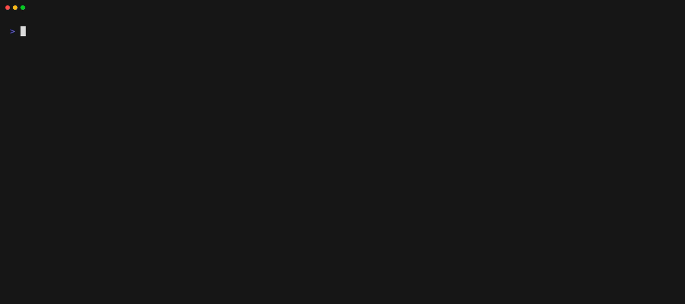

# stack-effect

Scaffolding CLI for full-stack TypeScript apps built on Effect.



## Quick Start

```bash
bunx stack-effect init my-app
# or with npx
npx stack-effect init my-app
```

Then add targets and modules to your project:

```bash
# Interactive mode — guided prompts
bunx stack-effect add

# Non-interactive — specify what you need
bunx stack-effect add --target server/api --modules http-api-server --yes
```

## What You Get

A structured Effect-first monorepo:

```
my-app/
├── stack.effect.json
├── package.json
├── tsconfig.json
├── turbo.json
├── packages/
│   ├── config-typescript/
│   ╰── domain/
│       ╰── src/
│           ├── [+] Api.ts
│           ╰── [+] index.ts
╰── apps/
    ├── web/
    │   ╰── src/
    │       ├── [+] main.tsx
    │       ╰── [+] app.tsx
    ╰── api/
        ╰── src/
            ├── [+] index.ts
            ╰── Api/
                ├── [+] Health.ts
                ╰── [+] Hello.ts
```

## Usage

### `stack-effect init [project-name]`

Scaffolds a new project. Prompts for runtime (bun/node), monorepo tool, linting, formatting, and test framework.

| Flag                    | Description                   |
| ----------------------- | ----------------------------- |
| `--yes`                 | Accept defaults, skip prompts |
| `--dry-run`             | Preview without writing files |
| `--root <path>`         | Output directory              |
| `--runtime <bun\|node>` | Runtime selection             |

### `stack-effect add`

Adds targets and modules to an existing project. In interactive mode, select a target kind (client, server, cli, package), name it, then pick modules. Dependencies between modules are resolved automatically.

| Flag                   | Description                       |
| ---------------------- | --------------------------------- |
| `--target <kind/name>` | Target to add (e.g. `client/web`) |
| `--modules <id,...>`   | Modules to include                |
| `--yes`                | Skip confirmation prompts         |
| `--dry-run`            | Preview the plan without applying |

### `stack-effect graph`

Visualize the full catalog of available targets and modules.

| Flag                             | Description   |
| -------------------------------- | ------------- |
| `--format <table\|mermaid\|dot>` | Output format |

Run `stack-effect graph` to see all available targets and modules.

## Examples

Initialize a project with bun and add a client with an API connection:

```bash
bunx stack-effect init my-app --runtime bun --yes

bunx stack-effect add --target client/web --modules http-api-client --yes
```

The `http-api-client` module automatically implies `http-api-server` on a server target, so both sides of the API are scaffolded together.

## Contributing

See [CONTRIBUTING.md](./CONTRIBUTING.md) for development setup and guidelines.

## License

MIT
