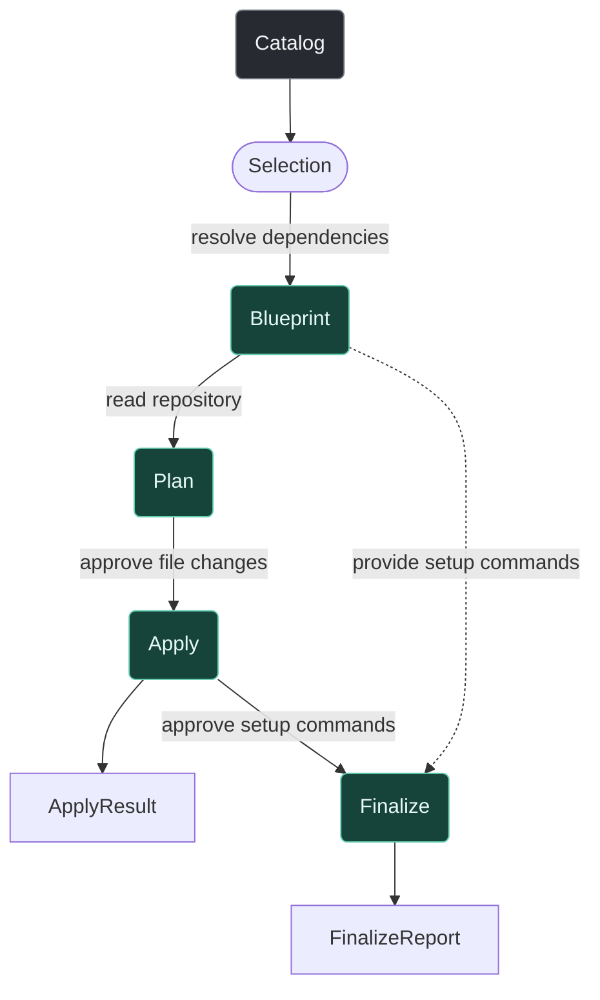

# How Stack Effect changes your repository

Before Stack Effect changes a generated file, it shows you two things: the complete project shape it resolved and the repository changes it plans to make. You approve each separately. Only then does Apply write files, followed by any Finalize setup commands you choose to run.

Follow an HTTP API through that lifecycle to see what Stack Effect reads, what it writes, and where it waits for you.

## Follow one change through Stack Effect

Start with an initialized Stack Effect repository and run the interactive add flow:

```sh
stack-effect add
```

Choose the `server` target, name it `api`, and add its HTTP API module. That request is equivalent to `server/api:server-http-api`.

A **target** owns a location in the repository. A **module** adds a capability to its target. If that capability needs something elsewhere, Stack Effect models it as a dependency instead of letting one module write into an unrelated target.

The HTTP API needs shared domain contracts, so your server request also brings in `domain-api-contracts` on a domain target. Stack Effect shows you that complete shape before it examines any files.

## First, Stack Effect resolves the project shape

The read-only **Catalog** lists the available targets and modules, where each module can attach, and which dependencies it requires.

Your choices become a **Selection**. In this example, that means the `api` server target and its HTTP API module. The `add` command also includes workspace choices already recorded in `stack.effect.json`. Required dependencies are not part of the Selection yet.

Stack Effect resolves those dependencies into a **Blueprint**. Because the HTTP API needs `domain-api-contracts`, the Blueprint adds the domain target and that module. Dependency resolution happens in memory. Apart from loading the workspace configuration, Stack Effect has not inspected the planned scaffold paths or written any files yet.

The CLI shows the Blueprint at **Continue with these changes?**. This is your first checkpoint:

> Is this the project shape I want, including the required dependencies?

## Then it compares that shape with your repository

Once you approve the Blueprint, Stack Effect reads the repository as it exists at that moment and builds a **Plan**. The Plan remains read-only. It classifies every intended path:

| Classification | Meaning                                                                                            |
| -------------- | -------------------------------------------------------------------------------------------------- |
| `create`       | The path is missing, so Apply can create it.                                                       |
| `modify`       | The path exists and Stack Effect can compose the intended change into it.                          |
| `unchanged`    | The repository already contains the intended result.                                               |
| `conflict`     | Stack Effect cannot safely choose the resulting content. The CLI displays this as **needs merge**. |

The CLI shows these outcomes at **Apply changes?**. This is a different decision from approving the Blueprint:

> Are these the file changes I want in this repository?

Use `--dry-run` to inspect the Blueprint and Plan without writing files or running setup commands. Add `--show-files` when you also want to see the proposed contents. The generated [`add` reference](/reference/cli/add) documents the exact flags.

## Only Apply writes files

Once you approve the planned outcomes, the workflow crosses its write boundary. **Apply** creates and updates files according to the Plan. Its **ApplyResult** records what was actually created, modified, skipped, or failed.

Plan classifications and ApplyResult outcomes answer different questions. An `unchanged` path needs no write, so Apply reports it as skipped. A conflict you choose to leave alone is also skipped. A planned write can still fail while it is being performed.

If the Plan contains a conflict, the interactive CLI asks what to do with that path before the final Apply confirmation:

- `skip` leaves the path untouched;
- `override` lets Stack Effect replace the conflicting content.

Those choices belong to Apply, not Plan. The Plan records what Stack Effect found; Apply combines that information with your decision about what may be written. `--yes` does not silently replace conflicts—it skips them.

A Plan only describes the repository snapshot it inspected. If a person, editor, or another process changes a relevant file before Apply, plan again instead of relying on stale outcomes.

## Finalize runs setup commands separately

Writing files is not always the last step. Modules can also provide setup commands, such as installing dependencies, formatting generated files, or completing project setup. These run during **Finalize**, after Apply has written the files.

In an interactive run, the CLI shows a preselected list before running anything. You can change that selection. A dry run previews the commands without running them.

`--trust` skips the command-selection prompt and runs every Finalize command. `--yes` does the same, which is why `init my-app --yes` is fully non-interactive.

The **FinalizeReport** records which attempted commands succeeded or failed. It is not a build report and does not prove that the generated application works. ApplyResult tells you what happened to the files; FinalizeReport tells you what happened to the commands.

Your third checkpoint is therefore:

> Am I comfortable running these setup commands?

## The lifecycle in one view



The main file-change path is `Catalog -> Selection -> Blueprint -> Plan -> Apply -> ApplyResult`. Finalize uses the script definitions from the Blueprint, but it crosses a separate command-execution boundary after Apply.

## What changes during init and create?

The same lifecycle powers `init` and `create`, with a few entry-point details worth knowing.

Unless it is a dry run, `init` writes `stack.effect.json` before resolving the scaffold. With `--yes`, it accepts the default configuration, runs every Finalize command without another prompt, and initializes, stages, and commits a Git repository by default. Run `init my-app` interactively to choose the configuration and review those commands. Add `--no-git` when you do not want Stack Effect to initialize and commit the repository. The generated [`init` reference](/reference/cli/init) lists every option.

The [`create` command](/reference/cli/create) combines project configuration with explicit target specifications. Once it has constructed a Selection, it follows the same Blueprint, Plan, Apply, and Finalize lifecycle.

## Review before you continue

Before approving a Stack Effect change, ask:

1. Is the resolved Blueprint the project shape I expected?
2. Are the planned file outcomes safe, including every conflict decision?
3. Am I comfortable running the selected Finalize commands?

After Apply, check the repository diff and run the generated project. The reports tell you what Stack Effect did; the diff and application tell you whether the result is what you wanted.

Use the [Builder](/builder) to explore available targets and modules without changing a repository. For machine-readable discovery, the [`schema` command](/reference/cli/schema) exposes the current Catalog and planning input. When you are ready to scaffold a project yourself, continue with [Getting started](/getting-started).
